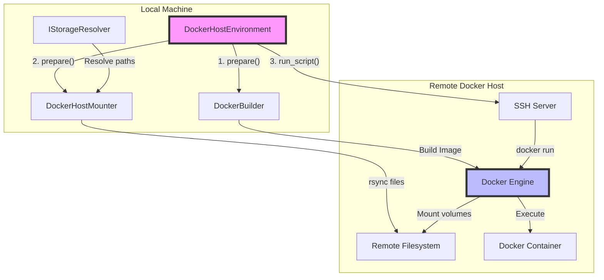
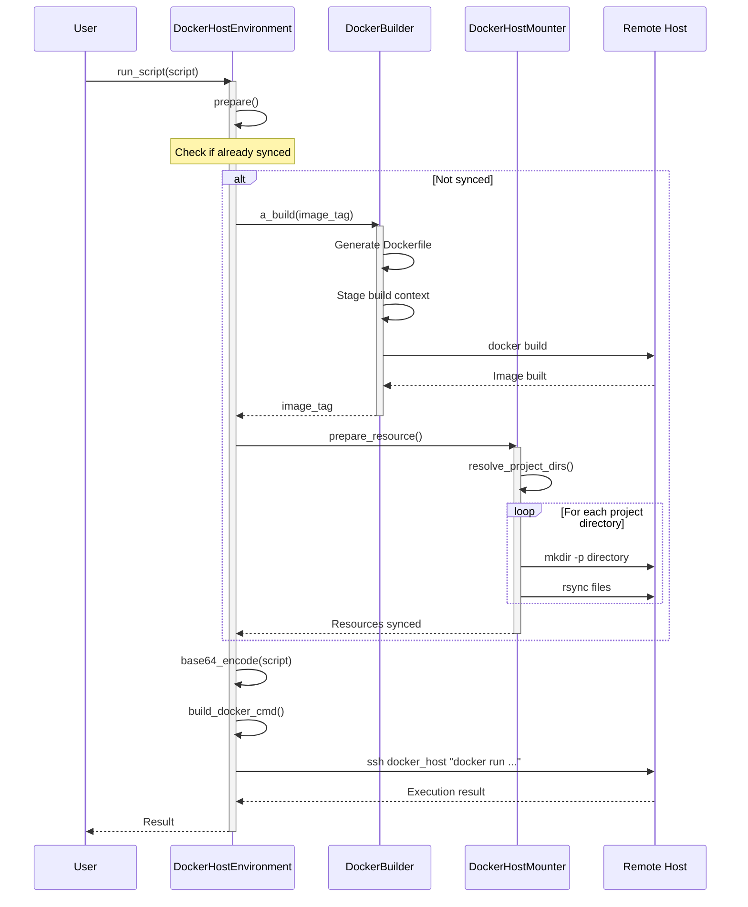
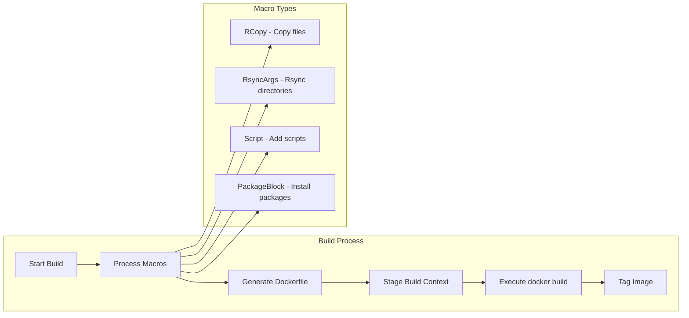
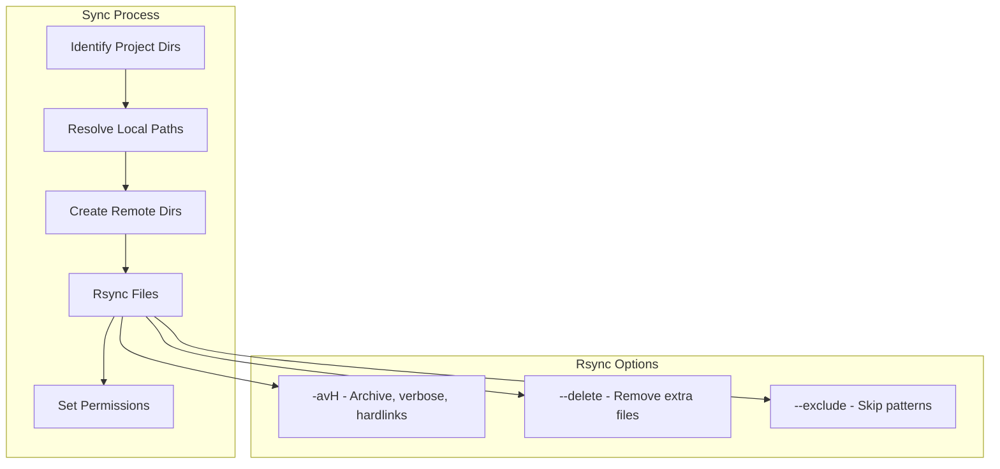
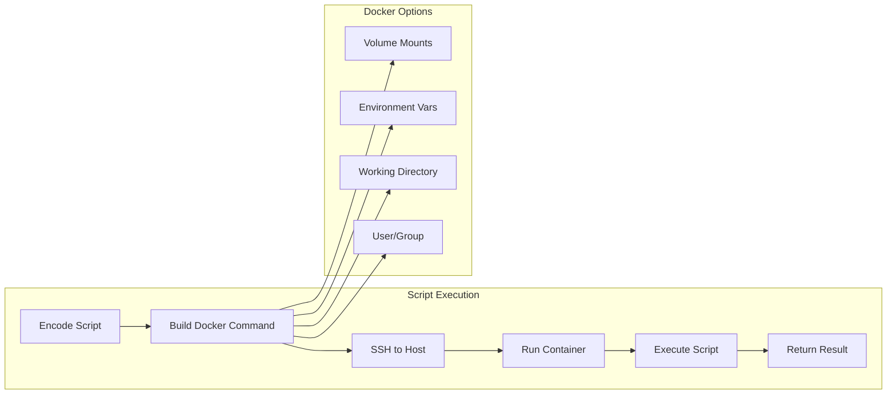
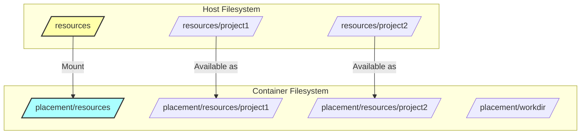
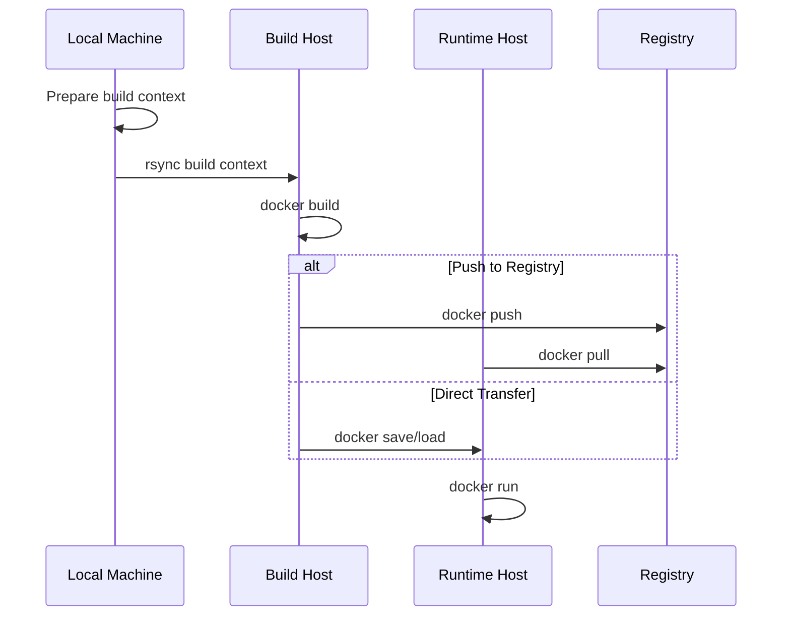

# DockerHostEnv Workflow: Building, Syncing, and Running

## Overview

The `DockerHostEnvironment` class provides a comprehensive solution for executing scripts and managing Docker containers on remote hosts. This document explains how the Docker host is set and used during the `run_script()` process, with a focus on building, syncing, and running operations.

> **Note**: Docker build commands can now be executed using different Docker contexts (like `zeus`, `colima`, etc.) via the `ml_nexus_docker_build_context` injection point.

## Architecture Overview



## Key Components

### 1. DockerHostEnvironment

The main orchestrator that coordinates all Docker operations on a remote host.

**Key Attributes:**
- `docker_host`: The hostname or IP address of the remote Docker host
- `docker_builder`: Handles Docker image building
- `mounter`: Handles file synchronization to the remote host
- `sync_lock`: Ensures synchronization happens only once
- `image_tag`: The Docker image tag to use

### 2. DockerHostMounter

Responsible for synchronizing project files to the remote Docker host using rsync.

**Key Methods:**
- `rsync_ids_to_root()`: Syncs project directories to the host
- `prepare_resource()`: Prepares resources for a specific project

### 3. DockerBuilder

Builds Docker images using a macro-based system that supports various operations.

**Key Features:**
- Macro-based Dockerfile generation
- BuildKit support for efficient builds
- File staging with hardlink optimization

## Workflow Sequence



## Detailed Process Flow

### 1. Docker Host Setting

The Docker host is set during the initialization of `DockerHostEnvironment`:

```python
@dataclass
class DockerHostEnvironment:
    docker_host: str  # Hostname or IP of the remote Docker host
    # ... other attributes
```

The `docker_host` parameter determines:
- Where SSH commands are sent
- Where Docker commands are executed
- Where files are synchronized

### 2. Building Process



**Key Steps:**
1. **Macro Processing**: Converts high-level operations into Dockerfile instructions
2. **Context Staging**: Creates a temporary directory with all required files
3. **Image Building**: Executes `docker build` on the remote host
4. **Caching**: Uses Docker's build cache for efficiency

### 3. Syncing Process



**Rsync Command Example:**
```bash
rsync -avH --delete \
  --exclude="*.pyc" \
  --exclude="__pycache__" \
  /local/project/path/ \
  remote_host:/resources/project_id/
```

### 4. Running Process



**Docker Run Command Structure:**
```bash
ssh docker_host "docker run \
  -v /resources:/placement/resources \
  -w /placement/workdir \
  -e ENV_VAR=value \
  --rm \
  image_tag \
  python -c 'base64_decoded_script'"
```

## Key Methods Explained

### prepare()

The `prepare()` method orchestrates both building and syncing:

```python
async def prepare(self):
    async with self.sync_lock:
        if self.synced.is_set():
            return self.image_tag
        else:
            # Build Docker image
            image = await self.docker_builder.a_build(self.image_tag, use_cache=True)
            
            # Sync files to remote host
            await self.mounter.prepare_resource(self.docker_host, self.project)
            
            self.synced.set()
            return image
```

### run_script()

Executes a Python script inside a Docker container on the remote host:

```python
async def run_script(self, py_script: str, **kw):
    # Ensure resources are prepared
    await self.prepare()
    
    # Encode script for safe transmission
    py_script_b64 = self.base64_encode_script(py_script)
    
    # Build Docker command with all options
    cmd = self.build_docker_cmd(py_script_b64, **kw)
    
    # Execute via SSH on remote host
    await self._a_system_parallel(f'ssh {self.docker_host} {cmd}')
```

## Volume Mounting Strategy



## Performance Optimizations

1. **Sync Lock**: Prevents redundant synchronization operations
2. **Hardlinking**: Uses hardlinks for file staging when possible
3. **Parallel Rsync**: Synchronizes multiple directories concurrently
4. **Build Cache**: Leverages Docker's build cache
5. **Selective Sync**: Only syncs required project directories

## Security Considerations

1. **SSH Authentication**: Requires proper SSH key configuration
2. **Docker Permissions**: Remote user must have Docker access
3. **File Permissions**: Maintains proper file ownership during sync
4. **Network Security**: All communication happens over SSH

## Example Usage

```python
# Initialize DockerHostEnvironment
env = DockerHostEnvironment(
    docker_host="remote-server.example.com",
    docker_builder=docker_builder,
    project=project_definition,
    placement=placement_config,
    mounter=docker_host_mounter,
    image_tag="myapp:latest"
)

# Run a script (handles building, syncing, and execution)
await env.run_script("""
import pandas as pd
df = pd.read_csv('/placement/resources/data.csv')
print(df.head())
""")
```

## Troubleshooting

### Common Issues

1. **SSH Connection Failed**
   - Verify SSH key configuration
   - Check network connectivity
   - Ensure remote host is accessible

2. **Docker Build Failed**
   - Check Dockerfile syntax
   - Verify base image availability
   - Review build context size

3. **Rsync Failed**
   - Ensure rsync is installed on both hosts
   - Check file permissions
   - Verify disk space availability

4. **Container Execution Failed**
   - Check Docker daemon status
   - Verify image exists
   - Review container logs

## Docker Build Context Support

### Docker Contexts

Docker contexts allow you to switch between different Docker endpoints without modifying your commands. The `a_build_docker` function now supports building images using any configured Docker context.

### Available Docker Contexts

To list available Docker contexts:
```bash
docker context ls
```

Example output:
```
NAME              DESCRIPTION                               DOCKER ENDPOINT
colima *          colima                                    unix:///Users/user/.colima/default/docker.sock
default           Current DOCKER_HOST based configuration   unix:///var/run/docker.sock
zeus                                                        tcp://zeus:2375
```

### Implementation

The `a_build_docker` function now accepts a `ml_nexus_docker_build_context` parameter:

```python
@injected
async def a_build_docker(
        a_system,
        ml_nexus_debug_docker_build,
        ml_nexus_docker_build_context,  # Docker context name
        logger,
        /,
        tag,
        context_dir,
        options: str,
        push: bool = False,
        build_id=None
):
    # Build docker command with context if specified
    docker_cmd = "docker"
    if ml_nexus_docker_build_context:
        logger.info(f"Using Docker context: {ml_nexus_docker_build_context}")
        docker_cmd = f"docker --context {ml_nexus_docker_build_context}"
    
    # Execute docker build
    build_cmd = f"{docker_cmd} build {options} -t {tag} {context_dir}"
    await a_system(build_cmd)
```

### Configuration

The Docker build context can be configured in two ways:

1. **Environment Variable** (default approach):
   ```bash
   export ML_NEXUS_DOCKER_BUILD_CONTEXT=zeus
   ```

2. **Design Override** (for project-specific configuration):
   ```python
   __meta_design__ = design(
       # Override the default to use a specific Docker context
       ml_nexus_docker_build_context="zeus",
   )
   ```

The design override takes precedence over the environment variable.

### Usage Example

When you build Docker images with ml-nexus, they will automatically use the configured context:

```python
# With ML_NEXUS_DOCKER_BUILD_CONTEXT=zeus set in environment
# All Docker builds will use: docker --context zeus build ...

# Or override in your project:
from ml_nexus import design

__meta_design__ = design(
    ml_nexus_docker_build_context="colima",  # Use colima instead of zeus
)

# Now builds will use: docker --context colima build ...
```

### SSH-based Remote Builds

For scenarios where Docker contexts are not configured, a separate function `a_build_docker_ssh_remote` is available for SSH-based remote builds:

```python
await a_build_docker_ssh_remote(
    tag="myimage:latest",
    context_dir="/path/to/context",
    options="--no-cache",
    remote_host="build-server.example.com"
)
```

### Build Context Synchronization

For remote builds, the build context needs to be synchronized efficiently:



## Conclusion

The DockerHostEnvironment provides a robust solution for remote Docker execution with:
- Efficient file synchronization using rsync
- Flexible Docker image building with macros
- Secure remote execution via SSH
- Performance optimizations for large projects
- **Implemented**: Docker context support via `ml_nexus_docker_build_context` (supports `zeus`, `colima`, etc.)
- **Implemented**: SSH-based remote Docker builds via `a_build_docker_ssh_remote`

This architecture enables seamless development and deployment workflows across distributed computing resources.