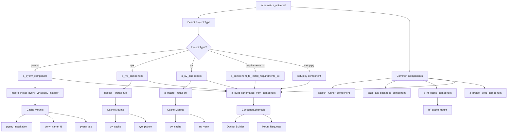
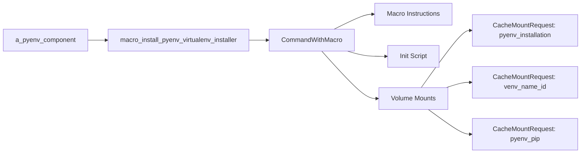
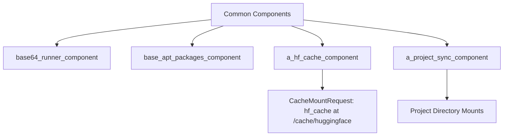
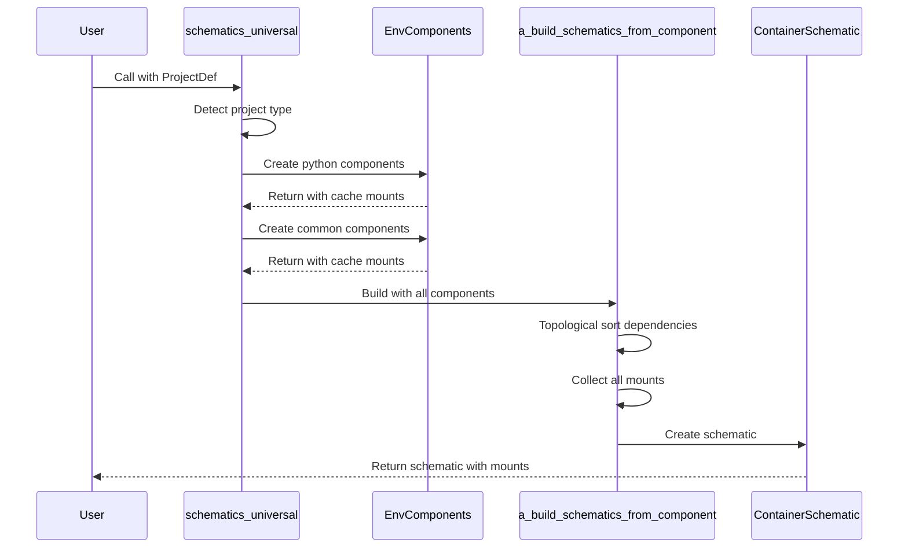

# Schematics Universal Architecture

## Overview

The `schematics_universal` function is the central orchestrator that creates container schematics for different project types. It automatically detects the project type (pyenv, rye, uv, poetry, setup.py, requirements.txt) and configures appropriate components with proper cache mount declarations.

## Architecture Diagram



## Component Flow

### 1. Entry Point: `schematics_universal`

```python
async def schematics_universal(
    target: ProjectDef,
    base_image: Optional[str] = None,
    python_version: Optional[str] = None,
    additional_components: Sequence[EnvComponent] = ()
)
```

The function:
1. Detects project type via `a_prepare_setup_script_with_deps`
2. Creates appropriate Python environment components
3. Assembles common components
4. Builds final schematic with all mount requests

### 2. Python Environment Components

#### a_pyenv_component
- **Purpose**: Creates isolated Python environments using pyenv
- **Cache Directories**:
  - `/root/.pyenv` - PyEnv installation cache
  - `/root/virtualenvs/{name}_{id}` - Virtual environment cache
  - `/root/pip_cache` - Pip package cache



#### a_rye_component
- **Purpose**: Rye-based Python project management
- **Cache Directories**:
  - `/root/.cache/uv` - UV cache (Rye uses UV internally)
  - `/opt/rye/py` - Rye Python installations

#### a_uv_component
- **Purpose**: UV-based Python project management
- **Cache Directories**:
  - `/root/.cache/uv` - UV cache
  - `/root/.cache/uv_venv` - UV virtual environments

### 3. Common Components



### 4. Cache Mount Declaration System

All cache directories are properly declared using `CacheMountRequest` objects:

```python
@dataclass
class CacheMountRequest(MountRequest):
    cache_name: str
    container_path: Path
```

These cache mounts are:
- **Persistent across builds**: Reused between container builds
- **Not part of container filesystem**: Don't count towards container storage
- **Properly isolated**: Each cache has a unique identifier

## Cache Directory Summary

| Component | Cache Name | Container Path | Purpose |
|-----------|------------|----------------|---------|
| a_pyenv_component | pyenv_installation | /root/.pyenv | PyEnv binaries and Python builds |
| a_pyenv_component | venv_name_id | /root/virtualenvs/name_id | Virtual environment (dynamically named) |
| a_pyenv_component | pyenv_pip | /root/pip_cache | Pip package cache |
| a_rye_component | uv_cache | /root/.cache/uv | UV dependency cache |
| a_rye_component | rye_python | /opt/rye/py | Rye Python installations |
| a_uv_component | uv_cache | /root/.cache/uv | UV dependency cache |
| a_uv_component | uv_venv | /root/.cache/uv_venv | UV virtual environments |
| a_hf_cache_component | hf_cache | /cache/huggingface | HuggingFace model cache |

## Build Process



## Key Design Principles

1. **Separation of Concerns**: Each component handles its own cache requirements
2. **Dependency Management**: Components can declare dependencies on other components
3. **Mount Aggregation**: All mount requests are collected and passed to the final schematic
4. **Cache Isolation**: Each project gets unique cache identifiers to prevent conflicts
5. **Platform Agnostic**: Cache mounts are declared but actual enforcement happens at the platform level

## Usage Example

```python
# Create schematic for a pyenv project
schematic = await schematics_universal(
    target=ProjectDef(dirs=[ProjectDir('my_project', kind='auto')]),
    base_image='nvidia/cuda:12.3.1-devel-ubuntu22.04',
    python_version='3.12'
)

# The schematic will contain:
# - Docker build instructions
# - All cache mount requests
# - Init scripts for environment setup
```

## Important Notes for MLPlatformJob

When using these schematics in an MLPlatformJob environment:

1. **All cache directories are properly declared** as `CacheMountRequest` objects
2. The platform can enforce size limits (like 8GB) on these declared caches
3. Caches are mounted at runtime, not baked into the image
4. Multiple jobs can share the same cache mounts for efficiency
5. The cache content doesn't count towards the job's storage quota

This architecture ensures that:
- No cache data accumulates inside the job container
- All cacheable content is properly externalized
- The platform has full visibility of cache requirements
- Jobs won't be killed due to cache storage exceeding limits