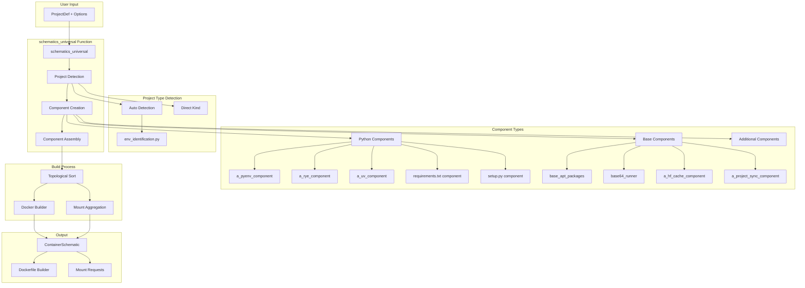
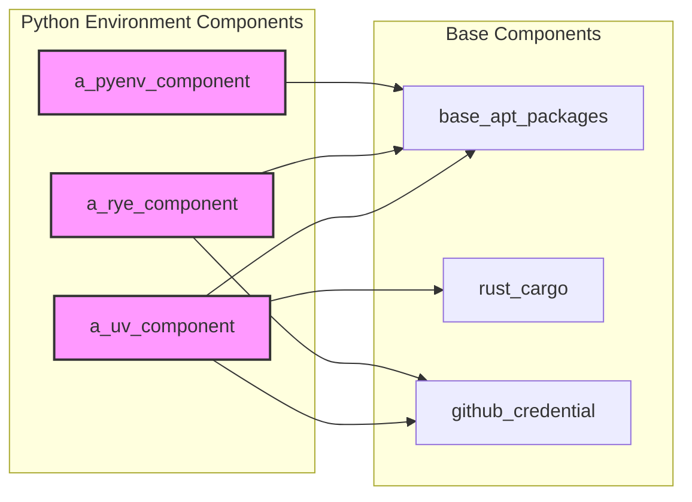
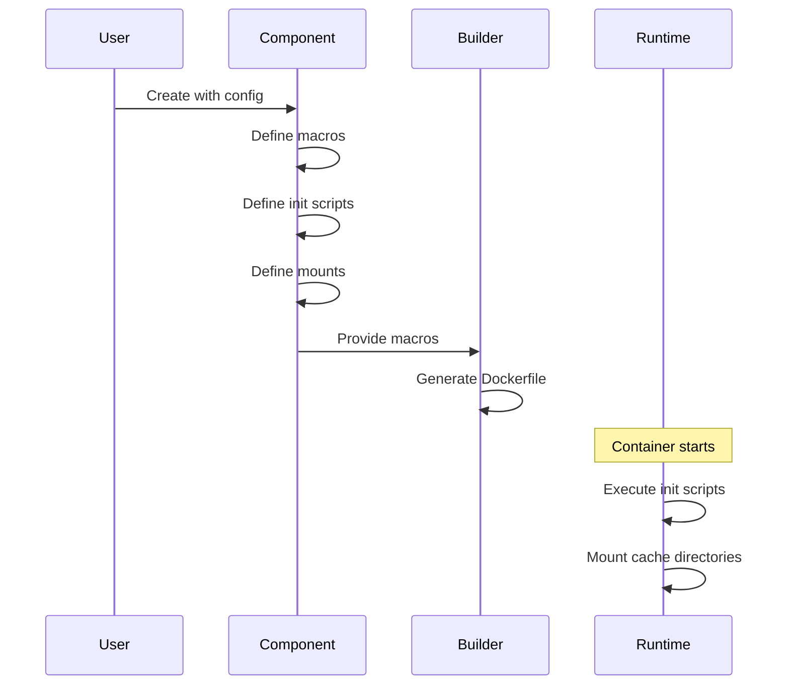
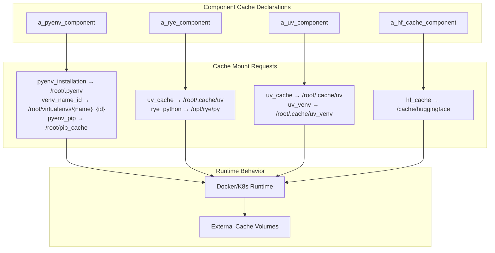

# Schematics Universal: Philosophy and Usage Guide

## Table of Contents
1. [Philosophy](#philosophy)
2. [Core Concepts](#core-concepts)
3. [Architecture Overview](#architecture-overview)
4. [Component System](#component-system)
5. [Project Type Detection](#project-type-detection)
6. [Usage Patterns](#usage-patterns)
7. [Integration with Docker](#integration-with-docker)
8. [Cache Management](#cache-management)
9. [Examples](#examples)
10. [Best Practices](#best-practices)

## Philosophy

The `schematics_universal` system embodies several key philosophical principles:

### 1. **Unified Interface for Diverse Projects**
Different Python projects use different package managers (pip, poetry, rye, uv) and project structures (setup.py, pyproject.toml, requirements.txt). Rather than forcing developers to write custom Docker configurations for each type, `schematics_universal` provides a single, consistent interface that automatically adapts to the project type.

### 2. **Component-Based Architecture**
The system is built on composable components (`EnvComponent`). Each component encapsulates:
- Installation steps (macros)
- Initialization scripts
- Mount requirements
- Dependencies on other components

This allows for modular, reusable, and testable configurations.

### 3. **Explicit Cache Management**
All cache directories are explicitly declared as `CacheMountRequest` objects. This ensures:
- Caches are external to the container filesystem
- Multiple containers can share caches
- Platform (like MLPlatformJob) can enforce size limits
- No hidden accumulation of cache data in containers

### 4. **Separation of Build and Runtime**
The system clearly separates:
- **Build-time configuration** (Dockerfile generation via macros)
- **Runtime initialization** (init scripts executed when container starts)
- **Mount configuration** (cache and resource directories)

## Core Concepts

### EnvComponent
The fundamental building block of the system:

```python
@dataclass
class EnvComponent:
    installation_macro: Macro  # Dockerfile commands
    init_script: list[str]     # Runtime initialization
    mounts: List[MountRequest] # Cache/resource mounts
    dependencies: List['EnvComponent']  # Other required components
```

### ContainerSchematic
The final output containing:
- Docker builder with all macros and scripts
- All mount requests aggregated from components

### ProjectDef and ProjectDir
Define the project structure:
- `ProjectDef`: Container for one or more project directories
- `ProjectDir`: Individual directory with type (`kind`) and dependencies

## Architecture Overview



## Component System

### Component Dependency Graph



### Component Lifecycle



## Project Type Detection

### Detection Flow

```mermaid
graph TD
    START[Project Directory]
    KIND{Check 'kind' field}
    
    KIND -->|auto| AUTO[Auto Detection]
    KIND -->|uv| UV[UV Project]
    KIND -->|rye| RYE[Rye Project]
    KIND -->|source| SRC[Source Only]
    KIND -->|poetry| POETRY[Poetry Project]
    
    AUTO --> CHECK{Check Files}
    CHECK -->|pyproject.toml exists| PYPROJ{Parse pyproject.toml}
    CHECK -->|setup.py only| SETUP[Setup.py Project]
    CHECK -->|requirements.txt only| REQ[Requirements.txt Project]
    CHECK -->|No files| ERR[Error]
    
    PYPROJ -->|has [tool.uv]| UV
    PYPROJ -->|has poetry sections| POETRY
    PYPROJ -->|has rye mentions| RYE
    PYPROJ -->|default| UV
```

### File Priority Rules

1. **Single file exists**: Use that file's project type
2. **Multiple files exist**: Priority order:
   - pyproject.toml (check for tool-specific sections)
   - setup.py
   - requirements.txt
3. **No files**: Error

## Usage Patterns

### Basic Usage with IProxy

```python
from pinjected import IProxy
from ml_nexus.project_structure import ProjectDef, ProjectDir
from ml_nexus.schematics_util.universal import schematics_universal

# Create IProxy for lazy evaluation - NO await needed
test_schematic: IProxy = schematics_universal(
    target=ProjectDef(dirs=[ProjectDir('my_project', kind='auto')]),
    base_image='python:3.11-slim',
    python_version='3.11'
)

# Run with pinjected CLI:
# uv run pinjected run module.path.test_schematic
```

### With Multiple Directories

```python
# Complex project with multiple directories - creates IProxy
test_mixed_project: IProxy = schematics_universal(
    target=ProjectDef(dirs=[
        ProjectDir('main_app', kind='uv'),
        ProjectDir('shared_utils', kind='source', dependencies=[]),
        ProjectDir('data_files', kind='resource')
    ]),
    base_image='nvidia/cuda:12.3.1-devel-ubuntu22.04'
)

# Access schematic properties through IProxy chaining
test_dockerfile: IProxy = test_mixed_project.builder.dockerfile
test_mounts: IProxy = test_mixed_project.mount_requests
```

### With Additional Components

```python
# Custom component with @instance decorator
@instance
async def cuda_toolkit_component():
    return EnvComponent(
        installation_macro=[
            "RUN apt-get update && apt-get install -y cuda-toolkit-12-3",
            "ENV CUDA_HOME=/usr/local/cuda"
        ],
        init_script=["nvidia-smi"],
        mounts=[CacheMountRequest('cuda_cache', Path('/cache/cuda'))]
    )

# Use with schematics_universal - pass the component directly
test_with_cuda: IProxy = schematics_universal(
    target=ProjectDef(dirs=[ProjectDir('gpu_project', kind='uv')]),
    additional_components=[cuda_toolkit_component]  # No await, pass IProxy
)
```

### Real-World IProxy Patterns from ml-nexus

```python
# Pattern 1: Direct IProxy definition for different project kinds
test_schematics_uv: IProxy = schematics_universal(
    target=ProjectDef(dirs=[ProjectDir('test_uv_project', kind='uv')]),
    base_image='python:3.11-slim'
)

test_schematics_rye: IProxy = schematics_universal(
    target=ProjectDef(dirs=[ProjectDir('test_rye_project', kind='rye')]),
    base_image='python:3.11-slim'
)

# Pattern 2: Chaining operations on IProxy
test_dockerfile: IProxy = schematics_universal(
    target=ProjectDef(dirs=[ProjectDir('my_app', kind='uv')]),
    base_image='python:3.11-slim'
).builder.dockerfile

# Pattern 3: Using Injected.list for component composition
test_schematic: IProxy = a_build_schematics_from_component(
    base_image='ubuntu:20.04',
    components=Injected.list(
        a_project_sync_component(tgt=project),
        a_uv_component(project),
        a_hf_cache_component(),
        base64_runner_component,
    )
)
```

## Integration with Docker

### Docker Environment Creation with Pinjected

```python
from ml_nexus.docker.builder.docker_env_with_schematics import DockerEnvFromSchematics
from ml_nexus.docker.builder.persistent import PersistentDockerEnvFromSchematics
from pinjected import injected, IProxy

# Create Docker environment using injected constructor pattern
test_docker_env: IProxy = injected(DockerEnvFromSchematics)(
    project=ProjectDef(dirs=[ProjectDir('my_app', kind='uv')]),
    schematics=test_schematic,  # IProxy from schematics_universal
    docker_host='zeus'
)

# Run commands - creates IProxy for the result
test_run_result: IProxy = test_docker_env.run_script("""
    python --version
    pip list
""")

# Run with: uv run pinjected run module.path.test_run_result
```

### Persistent Docker Environment with IProxy

```python
# Create persistent container as IProxy
test_persistent_env: IProxy = injected(PersistentDockerEnvFromSchematics)(
    project=ProjectDef(dirs=[ProjectDir('ml_training', kind='uv')]),
    schematics=test_schematic,
    docker_host='zeus',
    container_name='test_ml_training'
)

# Container persists between runs
test_training: IProxy = test_persistent_env.run_script("python train.py")

# Chain multiple operations
test_evaluation: IProxy = test_persistent_env.run_script("python evaluate.py")
```

## Cache Management

### Cache Directory Mapping



### Cache Benefits

1. **Faster Builds**: Reuse downloaded packages
2. **Reduced Storage**: Caches don't count toward container size
3. **Shared Resources**: Multiple containers share caches
4. **Platform Control**: MLPlatformJob can enforce limits

## Examples

### Example 1: UV Project with HuggingFace Cache

```python
# Using IProxy pattern - no async/await needed
test_ml_training: IProxy = schematics_universal(
    target=ProjectDef(dirs=[
        ProjectDir('ml_training', kind='uv')
    ]),
    base_image='nvidia/cuda:12.3.1-runtime-ubuntu22.04',
    python_version='3.11'
)

# Access schematic properties
test_ml_dockerfile: IProxy = test_ml_training.builder.dockerfile
test_ml_caches: IProxy = test_ml_training.mount_requests

# The schematic automatically includes:
# - UV environment setup
# - HuggingFace cache at /cache/huggingface
# - UV cache at /root/.cache/uv
```

### Example 2: Multi-Project Setup

```python
# Define multi-project structure
test_microservices: IProxy = schematics_universal(
    target=ProjectDef(dirs=[
        ProjectDir('api_service', kind='uv'),
        ProjectDir('worker_service', kind='rye'),
        ProjectDir('shared_config', kind='resource'),
        ProjectDir('legacy_scripts', kind='source')
    ]),
    base_image='python:3.11-slim'
)

# Each directory gets appropriate setup:
# - api_service: UV sync
# - worker_service: Rye sync
# - shared_config: Mounted as resource
# - legacy_scripts: Available but no env setup

# Create Docker environment from the schematic
test_services_env: IProxy = injected(DockerEnvFromSchematics)(
    project=ProjectDef(dirs=[ProjectDir('services', kind='auto')]),
    schematics=test_microservices,
    docker_host='zeus'
)
```

### Example 3: Custom Component Integration

```python
# Define custom component using @instance
@instance
def cuda_optimized_component():
    return EnvComponent(
        installation_macro=[
            "RUN apt-get update && apt-get install -y cuda-toolkit-12-3",
            "ENV CUDA_HOME=/usr/local/cuda",
            "ENV LD_LIBRARY_PATH=$CUDA_HOME/lib64:$LD_LIBRARY_PATH"
        ],
        init_script=[
            "nvidia-smi",  # Verify CUDA availability
        ],
        mounts=[
            CacheMountRequest('cuda_cache', Path('/cache/cuda'))
        ]
    )

# Use the component with schematics_universal
test_gpu_training: IProxy = schematics_universal(
    target=ProjectDef(dirs=[
        ProjectDir('gpu_trainer', kind='uv')
    ]),
    base_image='nvidia/cuda:12.3.1-devel-ubuntu22.04',
    additional_components=[cuda_optimized_component]  # Pass IProxy directly
)

# Analyze the schematic
@injected
def analyze_gpu_schematic(schematic, /):
    return {
        "base_image": schematic.builder.base_image,
        "has_cuda": any("cuda" in str(m) for m in schematic.builder.macros),
        "cache_count": len([m for m in schematic.mount_requests 
                           if isinstance(m, CacheMountRequest)])
    }

test_gpu_analysis: IProxy = analyze_gpu_schematic(test_gpu_training)
```

## Best Practices

### 1. **Use Auto Detection for Flexibility**
```python
# Good: Allows project to evolve
ProjectDir('my_project', kind='auto')

# Only specify kind when necessary
ProjectDir('legacy_app', kind='setup.py')
```

### 2. **Declare All Caches Explicitly**
```python
# Good: Explicit cache declaration
EnvComponent(
    mounts=[CacheMountRequest('my_cache', Path('/cache/my_tool'))]
)

# Bad: Hidden cache in filesystem
EnvComponent(
    installation_macro=["RUN mkdir -p /app/.cache"]  # Don't do this
)
```

### 3. **Use IProxy for Testing and Entry Points**
```python
# Good: IProxy definitions with type annotations
test_env: IProxy = schematics_universal(...)
test_analysis: IProxy = a_analyze_schematic(test_env)

# IMPORTANT: Always include IProxy type annotation
# Without it, pinjected won't recognize as entry point
my_schematic: IProxy = schematics_universal(...)  # ✓ Good
my_schematic = schematics_universal(...)          # ✗ Bad - no type annotation

# Run with: uv run pinjected run module.test_analysis
```

### 4. **Layer Components Properly**
```python
# Good: Clear dependency hierarchy
custom_component = EnvComponent(
    dependencies=[base_apt_packages_component],  # Explicit dependency
    ...
)
```

### 5. **Separate Concerns**
```python
# Good: Separate build and runtime
EnvComponent(
    installation_macro=["RUN apt-get install -y tool"],  # Build time
    init_script=["tool --init --config /app/config"],    # Runtime
)
```

### 6. **Use Appropriate Base Images**
```python
# For ML/GPU work
base_image='nvidia/cuda:12.3.1-runtime-ubuntu22.04'

# For lightweight services
base_image='python:3.11-slim'

# For full development
base_image='ubuntu:22.04'
```

## Troubleshooting

### Common Issues

1. **Project type not detected**
   - Ensure project has recognizable files (pyproject.toml, setup.py, etc.)
   - Use explicit `kind` if auto-detection fails

2. **Cache permissions**
   - Caches are mounted with container user permissions
   - Ensure init scripts don't change cache ownership

3. **Missing dependencies**
   - Check component dependencies are properly declared
   - Verify base image has required system packages

4. **Init script failures**
   - Test init scripts separately
   - Add error handling to init scripts
   - Check working directory is correct

### Debug Helpers

```python
# Analyze generated schematic
@injected
async def debug_schematic(schematic):
    return {
        "macros": len(schematic.builder.macros),
        "scripts": schematic.builder.scripts,
        "mounts": [m.cache_name for m in schematic.mount_requests 
                  if isinstance(m, CacheMountRequest)]
    }

# Test with minimal setup
test_minimal: IProxy = schematics_universal(
    target=ProjectDef(dirs=[ProjectDir('test', kind='source')]),
    base_image='python:3.11-slim'
)
```

## Important Pinjected Concepts for ml-nexus

### Understanding IProxy and Lazy Evaluation

**Critical Concept**: IProxy represents a lazy Abstract Syntax Tree (AST), not executed values:

```python
# This does NOT execute schematics_universal
# It builds an AST node representing the computation
my_schematic: IProxy = schematics_universal(
    target=ProjectDef(dirs=[ProjectDir('my_app', kind='uv')]),
    base_image='python:3.11-slim'
)

# This extends the AST with attribute access
my_dockerfile: IProxy = my_schematic.builder.dockerfile

# Actual execution happens only when you run:
# uv run pinjected run module.path.my_dockerfile
```

### @injected vs @instance in ml-nexus

```python
# @instance - for singleton components without runtime parameters
@instance
def ml_nexus_logger():
    return logger

@instance
async def hf_cache_component():
    return EnvComponent(
        mounts=[CacheMountRequest('hf_cache', Path('/cache/huggingface'))]
    )

# @injected - for functions with dependency injection + runtime parameters
@injected
async def a_uv_component(
    a_macro_install_uv,        # Injected dependency
    base_apt_packages_component,  # Injected dependency
    /,                         # Separator
    target: ProjectDef,        # Runtime parameter
    do_sync: bool = True      # Runtime parameter
):
    # Implementation
```

### Design Patterns in ml-nexus

```python
# Loading environment design
from ml_nexus import load_env_design

# Module-level design configuration
__meta_design__ = design(
    overrides=load_env_design + design(
        storage_resolver=my_storage_resolver,
        logger=logger
    )
)

# Constructor injection pattern
new_DockerEnvFromSchematics = injected(DockerEnvFromSchematics)
new_DockerBuilder = injected(DockerBuilder)
```

### Testing with Pinjected

Two approaches used in ml-nexus:

1. **IProxy Entry Points** (Recommended for schematics testing):
```python
# Define test cases as IProxy variables
test_uv_project: IProxy = schematics_universal(
    target=ProjectDef(dirs=[ProjectDir('test_uv', kind='uv')]),
    base_image='python:3.11-slim'
)

# Run: uv run pinjected run test.module.test_uv_project
```

2. **@injected_pytest** (For unit tests):
```python
from pinjected.test import injected_pytest

@injected_pytest(test_design)
async def test_component_creation(a_uv_component, logger):
    component = await a_uv_component(
        target=ProjectDef(dirs=[ProjectDir('test', kind='uv')])
    )
    assert component.mounts  # Has cache mounts
```

## Conclusion

The `schematics_universal` system provides a powerful, flexible way to create container configurations for diverse Python projects. By understanding its component-based architecture, explicit cache management, and separation of concerns, you can create efficient, maintainable container environments that work seamlessly across different platforms and project types.

Key takeaways:
- Use IProxy for lazy evaluation and composable operations
- Always include type annotations (`: IProxy`) for entry points
- Understand the difference between @instance (values) and @injected (functions)
- Leverage the component system for modular, reusable configurations
- Use proper cache management with CacheMountRequest
- Test using IProxy entry points or @injected_pytest