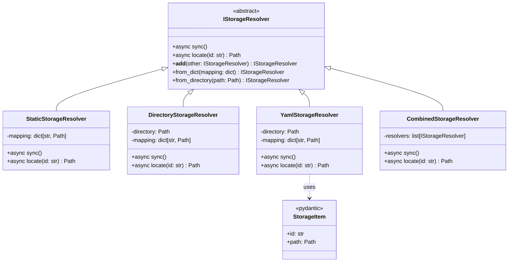
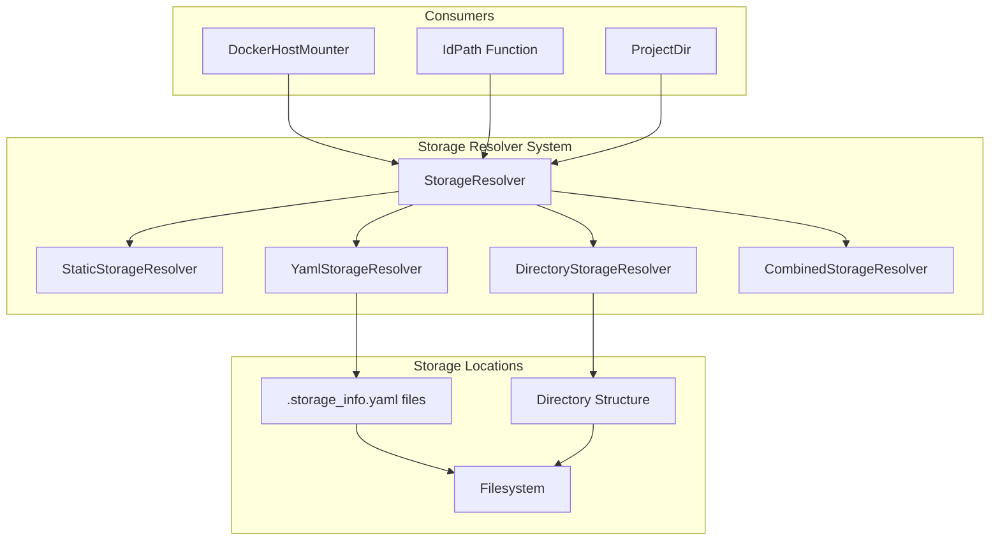
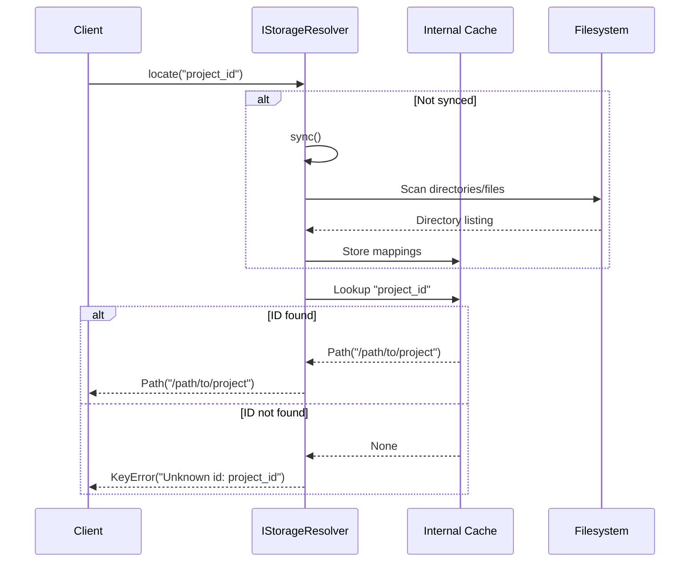
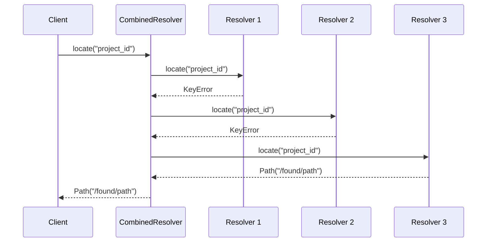

# StorageResolver Architecture

## Overview

The StorageResolver is a core abstraction in ml-nexus that provides a unified interface for locating project resources and source code across different storage locations. It bridges the gap between logical project identifiers and their physical filesystem paths, enabling flexible deployment scenarios and location-agnostic project references.

### Design Philosophy

The StorageResolver follows several key design principles:

1. **Abstraction over Location**: Projects are referenced by IDs, not paths, allowing the same configuration to work across different environments
2. **Composability**: Multiple resolvers can be combined to search across different storage locations
3. **Async-First**: All I/O operations are asynchronous for better performance in concurrent scenarios
4. **Fail-Fast**: Clear error messages when resources cannot be located
5. **Extensibility**: Easy to add new storage backends through the abstract interface

## Architecture

### Class Hierarchy



### Component Interactions



## Implementation Details

### When to Use Each Resolver Type

1. **DirectoryStorageResolver** (Default)
   - Best for: Simple project structures where directory names are project IDs
   - Use when: Projects follow a consistent naming convention
   - Default behavior: Used by ml-nexus for `ml_nexus_source_root` and `ml_nexus_resource_root`

3. **StaticStorageResolver**
   - Best for: Testing and fixed configurations
   - Use when: You have a known, unchanging set of projects
   - Common in: Unit tests and CI/CD environments

4. **CombinedStorageResolver**
   - Best for: Multi-location project storage
   - Use when: Projects are distributed across different directories
   - Default behavior: ml-nexus combines source and resource directories

### 1. StaticStorageResolver

The simplest implementation that maintains a static mapping of IDs to paths.

**Use Case**: Testing and fixed configurations

**Example**:
```python
resolver = StaticStorageResolver({
    "project_a": Path("/home/user/projects/project_a"),
    "shared_lib": Path("/opt/shared/libraries/common"),
    "test_data": Path("/tmp/test_data")
})

# No sync needed - mapping is static
path = await resolver.locate("project_a")  # Returns Path("/home/user/projects/project_a")
```

### 2. DirectoryStorageResolver

Treats each subdirectory as a storage item where the directory name is the ID.

**Use Case**: Simple project structures where folder names are unique identifiers

**Example**:
```python
# Directory structure:
# /home/user/sources/
#   ├── ml_project/
#   ├── data_pipeline/
#   └── utils/

resolver = DirectoryStorageResolver(Path("/home/user/sources"))
await resolver.sync()  # Scans subdirectories

path = await resolver.locate("ml_project")  # Returns Path("/home/user/sources/ml_project")
```

### 3. YamlStorageResolver

Scans for `.storage_info.yaml` files containing storage metadata.

**Use Case**: Complex projects with non-standard directory names or multiple entry points

**Example**:
```yaml
# /projects/alpha/.storage_info.yaml
id: customer_analytics
path: .

# /projects/beta/subfolder/.storage_info.yaml  
id: ml_models
path: models
```

```python
resolver = YamlStorageResolver(Path("/projects"))
await resolver.sync()  # Recursively finds .storage_info.yaml files

path1 = await resolver.locate("customer_analytics")  # Returns Path("/projects/alpha")
path2 = await resolver.locate("ml_models")  # Returns Path("/projects/beta/subfolder/models")
```

### 4. CombinedStorageResolver

Chains multiple resolvers, trying each until one succeeds.

**Use Case**: Searching across multiple storage locations with fallback

**Example**:
```python
resolver = (
    DirectoryStorageResolver(Path("~/sources")) +
    DirectoryStorageResolver(Path("~/projects")) +
    YamlStorageResolver(Path("/shared/resources"))
)

await resolver.sync()  # Syncs all child resolvers

# Tries each resolver in order until one succeeds
path = await resolver.locate("my_project")
```

## Sequence Diagrams

### Locate Operation Flow



### Combined Resolver Chain



## Integration Patterns

### 1. Docker Environment Integration

The StorageResolver is heavily used in Docker environments for mounting host directories:

```python
from pinjected import injected
from pathlib import Path

@injected
async def a_create_docker_mounter(
    storage_resolver: IStorageResolver,
    /,
    temp_dir: Path
) -> DockerHostMounter:
    mounter = DockerHostMounter(
        storage_resolver=storage_resolver,
        host_dir=temp_dir,
        container_dir="/host"
    )
    
    # Mount a project by ID
    await mounter.mount_resource(
        ProjectDir(id="ml_project", path=".")
    )
    
    return mounter
```

### 2. IdPath Function

The `IdPath` function provides a convenient way to resolve IDs in injected functions. It's already defined in ml_nexus and can be used directly:

```python
from pinjected import injected

# Usage example
@injected
async def a_process_project(IdPath, logger, /, project_id: str):
    # Resolve project ID to path
    project_path = await IdPath(project_id)
    logger.info(f"Processing project at: {project_path}")
    
    # Use the resolved path
    config_file = project_path / "config.yaml"
    if config_file.exists():
        config_data = config_file.read_text()
        # Process configuration...
```

### 3. Dependency Injection Configuration

**Important Configuration File Distinction:**
- `__pinjected__.py` - Module-level configuration file where `__design__` should be defined
- `.pinjected.py` - User-specific configuration file (in home directory or current directory)

The StorageResolver is configured in the pinjected framework. By default, ml-nexus uses only `DirectoryStorageResolver`:

```python
from pinjected import instance
from pathlib import Path

# Default configuration in ml_nexus/__init__.py
@instance
def local_storage_resolver_from_env(
        ml_nexus_logger,
        ml_nexus_source_root: Path,
        ml_nexus_resource_root: Path
):
    logger = ml_nexus_logger
    logger.info(
        f"Creating local storage resolver with source_root: {ml_nexus_source_root}, resource_root: {ml_nexus_resource_root}")
    logger.info(f"You can override storage resolver by setting 'storage_resolver' in __design__")
    from ml_nexus.storage_resolver import DirectoryStorageResolver
    return DirectoryStorageResolver(ml_nexus_source_root) + DirectoryStorageResolver(ml_nexus_resource_root)
```

Note: `YamlStorageResolver` is NOT used by default. To use it, you need to explicitly configure it in your `__pinjected__.py`:

```python
# Example: Configure custom source and resource roots in __pinjected__.py
from pathlib import Path
from pinjected import design

__design__ = design(
    # Configure custom paths (these will be used by local_storage_resolver_from_env)
    ml_nexus_source_root=Path("~/repos").expanduser(),
    ml_nexus_resource_root=Path("~/resources").expanduser(),
)

# Or in .pinjected.py (note: not __pinjected__.py) for user-specific configuration:
from pinjected import design

__design__ = design(
    ml_nexus_source_root=Path("~/repos").expanduser().absolute(),
    ml_nexus_resource_root=Path("~/resources").expanduser(),
)
```

To add YamlStorageResolver, you need to override the storage_resolver itself:

```python
# Example from tests: Using StaticStorageResolver for testing
from ml_nexus.storage_resolver import StaticStorageResolver
from pinjected import design
from ml_nexus import load_env_design

TEST_PROJECT_ROOT = Path(__file__).parent / "dummy_projects"

test_storage_resolver = StaticStorageResolver({
    "test_uv": TEST_PROJECT_ROOT / "test_uv",
    "test_rye": TEST_PROJECT_ROOT / "test_rye",
    "test_source": TEST_PROJECT_ROOT / "test_source",
})

test_design = design(
    storage_resolver=test_storage_resolver,
    logger=logger
)

# In __pinjected__.py
__design__ = load_env_design + test_design
```

## Best Practices

### 1. Environment-Specific Configuration

The recommended approach is to configure paths via `ml_nexus_source_root` and `ml_nexus_resource_root`:

```python
# In your project's __pinjected__.py
from pathlib import Path
from pinjected import design
from ml_nexus import load_env_design

# Development environment
__design__ = load_env_design + design(
    ml_nexus_source_root=Path("~/dev/sources").expanduser(),
    ml_nexus_resource_root=Path("~/dev/resources").expanduser(),
)

# Production environment in .pinjected.py (user-specific config)
from pinjected import design

__design__ = design(
    ml_nexus_source_root=Path("/opt/sources").absolute(),
    ml_nexus_resource_root=Path("/opt/resources"),
)

# Test environment (from test_best_practice_example.py)
TEST_PROJECT_ROOT = Path(__file__).parent / "dummy_projects"
test_storage_resolver = StaticStorageResolver({
    "test_uv": TEST_PROJECT_ROOT / "test_uv",
    "test_rye": TEST_PROJECT_ROOT / "test_rye",
})

test_design = design(
    storage_resolver=test_storage_resolver,
)

# In test file's __pinjected__.py
__design__ = load_env_design + test_design
```

### 2. Error Handling

```python
from pinjected import injected
from pathlib import Path

@injected
async def a_safe_locate(
    storage_resolver: IStorageResolver,
    logger,
    /,
    project_id: str,
    default: Path | None = None
) -> Path | None:
    try:
        return await storage_resolver.locate(project_id)
    except KeyError:
        if default is None:
            logger.error(f"Project '{project_id}' not found")
        return default
```

### 3. Caching and Performance

```python
from pinjected import injected

# Pre-sync resolvers during startup
@injected
async def a_initialize_app(storage_resolver: IStorageResolver, logger, /):
    logger.info("Syncing storage resolver...")
    await storage_resolver.sync()
    logger.info("Storage resolver ready")

# Resolver automatically caches after first sync
# No need to sync again unless storage changes
```

### 4. Testing with Static Resolver

Using patterns from actual test files in the codebase:

```python
# From test/test_best_practice_example.py
from pinjected.test import injected_pytest
from pinjected import design
from pathlib import Path
from ml_nexus.storage_resolver import StaticStorageResolver
from ml_nexus import load_env_design

# Set up test paths
TEST_PROJECT_ROOT = Path(__file__).parent / "dummy_projects"

# Create test storage resolver
test_storage_resolver = StaticStorageResolver({
    "test_uv": TEST_PROJECT_ROOT / "test_uv",
    "test_rye": TEST_PROJECT_ROOT / "test_rye",
    "test_source": TEST_PROJECT_ROOT / "test_source",
    "test_setuppy": TEST_PROJECT_ROOT / "test_setuppy",
    "test_requirements": TEST_PROJECT_ROOT / "test_requirements",
    "test_resource": TEST_PROJECT_ROOT / "test_resource",
})

# Create test design
test_design = design(
    storage_resolver=test_storage_resolver,
    logger=logger
)

# Configure design in __pinjected__.py
__design__ = load_env_design + test_design

# Test storage resolver functionality
@injected_pytest(test_design)
async def test_storage_resolver(storage_resolver, logger):
    """Test that our custom storage resolver works correctly"""
    # Sync the resolver
    await storage_resolver.sync()
    
    # Test locating projects
    uv_path = await storage_resolver.locate("test_uv")
    assert uv_path.exists()
    assert (uv_path / "pyproject.toml").exists()
    
    rye_path = await storage_resolver.locate("test_rye")
    assert rye_path.exists()
    assert (rye_path / "pyproject.toml").exists()

# Test combined resolver functionality
combined_test_design = design(
    storage_resolver=(
        StaticStorageResolver({"project1": Path("/path/1")}) +
        StaticStorageResolver({"project2": Path("/path/2")})
    )
)

@injected_pytest(combined_test_design)
async def test_combined_resolver(storage_resolver):
    # Should find from first resolver
    path1 = await storage_resolver.locate("project1")
    assert path1 == Path("/path/1")
    
    # Should find from second resolver
    path2 = await storage_resolver.locate("project2")
    assert path2 == Path("/path/2")

# Test with mock logger to verify behavior
class MockLogger:
    def __init__(self):
        self.logs = []
    
    def error(self, message):
        self.logs.append(("error", message))
    
    def info(self, message):
        self.logs.append(("info", message))

# Create test design with instances
from pinjected import instances

test_with_logger = test_design + design()
test_with_logger += instances(logger=MockLogger())

@injected_pytest(test_with_logger)
async def test_safe_locate_with_logging(a_safe_locate, logger):
    # Test with default None
    result = await a_safe_locate("non_existent")
    assert result is None
    assert any("Project 'non_existent' not found" in log[1] for log in logger.logs)
    
    # Test with custom default
    result = await a_safe_locate("non_existent", default=Path("/default"))
    assert result == Path("/default")
```

## Configuration Examples

### Environment Variables

```bash
# Multiple source directories
export ML_NEXUS_SOURCE_DIRS="~/sources:~/projects:/opt/shared"

# YAML configuration directory
export ML_NEXUS_YAML_DIR="/etc/ml_nexus/storage"
```

### YAML Storage Info Format

```yaml
# .storage_info.yaml
id: my_project
path: .  # Relative to the YAML file location

# Or with absolute path
id: shared_models
path: /mnt/shared/models
```

### Programmatic Configuration

```python
from pathlib import Path
from ml_nexus.storage_resolver import (
    IStorageResolver, 
    DirectoryStorageResolver, 
    YamlStorageResolver, 
    StaticStorageResolver
)

# Create custom resolver combination
def create_custom_resolver() -> IStorageResolver:
    # Priority order: local -> shared -> remote
    return (
        # Local development
        DirectoryStorageResolver(Path.home() / "dev") +
        
        # Shared team resources
        YamlStorageResolver(Path("/shared/team")) +
        
        # Remote mounted resources
        DirectoryStorageResolver(Path("/mnt/remote")) +
        
        # Fallback static mappings
        StaticStorageResolver({
            "legacy_project": Path("/old/system/project"),
            "archived_data": Path("/archive/2023/data")
        })
    )
```

## Troubleshooting

### Common Issues

1. **KeyError: Unknown id**
   - Ensure the resolver has been synced
   - Verify the ID exists in the storage location
   - Check resolver configuration includes the correct paths

2. **Empty resolver mapping**
   - For DirectoryStorageResolver: Check directory exists and has subdirectories
   - For YamlStorageResolver: Verify `.storage_info.yaml` files are present and valid

3. **Performance issues**
   - Pre-sync resolvers during application startup
   - Use StaticStorageResolver for known, fixed mappings
   - Limit directory depth for YamlStorageResolver scans

### Debug Logging

```python
from loguru import logger

# Enable debug logging for storage operations
with logger.contextualize(component="storage_resolver"):
    resolver = DirectoryStorageResolver(Path("/projects"))
    await resolver.sync()
    
    # Log all discovered mappings
    if hasattr(resolver, '_mapping'):
        for id, path in resolver._mapping.items():
            logger.debug(f"Discovered: {id} -> {path}")
```

## Using IdPath for Path Resolution

The `IdPath` function is the primary way to use StorageResolver in your code:

```python
from pinjected import injected
from pathlib import Path

# From src/ml_nexus/storage_resolver.py
@injected
async def IdPath(storage_resolver: IStorageResolver, /, id: str) -> Path:
    """
    This is to be used in place of Path so that the path is resolved by the storage_resolver.
    """
    return await storage_resolver.locate(id)

# Usage in your code
from pinjected import injected

@injected
async def a_process_project(IdPath, logger, /, project_id: str):
    # Resolve project path using IdPath
    project_path = await IdPath(project_id)
    logger.info(f"Processing project at: {project_path}")
    
    # Work with the resolved path
    config_file = project_path / "config.yaml"
    if config_file.exists():
        # Process the config...
        pass
```

## Advanced Testing Patterns

### Testing Directory Resolver with Real Filesystem

```python
from pinjected.test import injected_pytest
from pinjected import design
import tempfile
import shutil

@injected_pytest()
async def test_directory_resolver_real_fs():
    # Create temporary directory structure
    from pathlib import Path
    from ml_nexus.storage_resolver import DirectoryStorageResolver
    
    with tempfile.TemporaryDirectory() as temp_dir:
        temp_path = Path(temp_dir)
        
        # Create test projects
        (temp_path / "project_a").mkdir()
        (temp_path / "project_b").mkdir()
        (temp_path / "shared_lib").mkdir()
        
        # Create resolver
        resolver = DirectoryStorageResolver(temp_path)
        await resolver.sync()
        
        # Test locating projects
        assert await resolver.locate("project_a") == temp_path / "project_a"
        assert await resolver.locate("project_b") == temp_path / "project_b"
        assert await resolver.locate("shared_lib") == temp_path / "shared_lib"

# Testing YAML resolver
@injected_pytest()
async def test_yaml_resolver_real_fs():
    from pathlib import Path
    from ml_nexus.storage_resolver import YamlStorageResolver
    
    with tempfile.TemporaryDirectory() as temp_dir:
        temp_path = Path(temp_dir)
        
        # Create project structure
        project_dir = temp_path / "my_project"
        project_dir.mkdir()
        
        # Create .storage_info.yaml
        storage_info = project_dir / ".storage_info.yaml"
        storage_info.write_text("""
id: awesome_project
path: .
""")
        
        # Create nested project
        nested_dir = temp_path / "nested" / "deep"
        nested_dir.mkdir(parents=True)
        nested_storage = nested_dir / ".storage_info.yaml"
        nested_storage.write_text("""
id: deep_project
path: src
""")
        (nested_dir / "src").mkdir()
        
        # Test resolver
        resolver = YamlStorageResolver(temp_path)
        await resolver.sync()
        
        assert await resolver.locate("awesome_project") == project_dir
        assert await resolver.locate("deep_project") == nested_dir / "src"
```

### Testing Integration with Docker Environment

```python
# Test design for Docker integration
docker_test_design = design(
    storage_resolver=StaticStorageResolver({
        "ml_project": Path("/home/user/ml_project"),
        "data_source": Path("/mnt/data"),
        "config_repo": Path("/etc/configs")
    }),
    temp_dir=Path("/tmp/docker_test")
)

@injected_pytest(docker_test_design)
async def test_docker_mounter_integration(a_create_docker_mounter):
    # Create mounter with test resolver
    mounter = await a_create_docker_mounter(temp_dir=Path("/tmp/test"))
    
    # Verify mounter can resolve and mount projects
    assert mounter.storage_resolver is not None
    
    # Test would continue with actual Docker operations
    # (simplified here for documentation purposes)
```

## Future Enhancements

Potential improvements to the StorageResolver system:

1. **Remote Storage Support**: S3, GCS, or network file systems
2. **Caching Layer**: Redis or in-memory cache with TTL
3. **Watch Mode**: Auto-refresh when storage changes
4. **Metadata Extensions**: Additional project metadata beyond ID and path
5. **Plugin System**: Dynamic resolver registration
6. **Version Support**: Resolve specific versions of projects